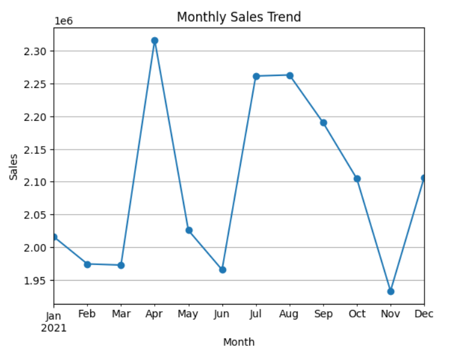
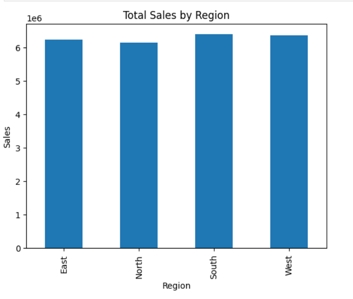
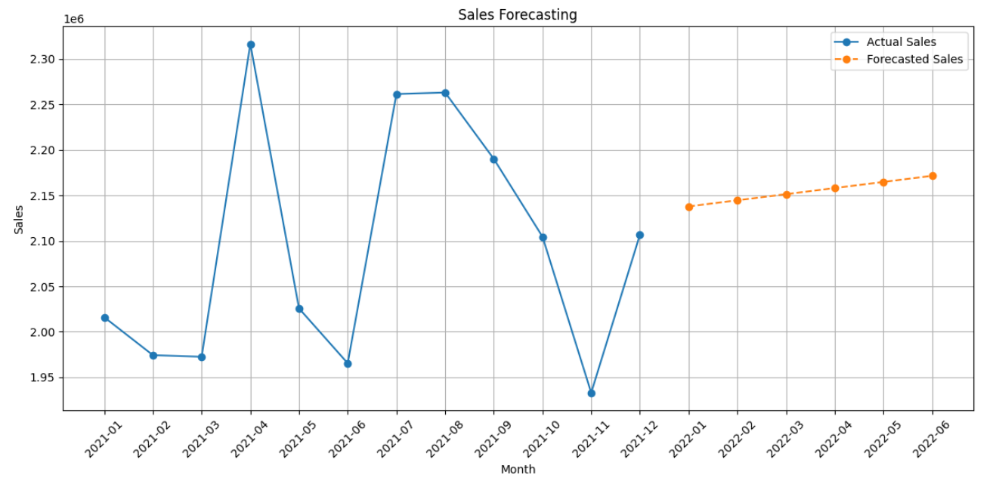

# 📊 Sales Data Analytics Project

This project provides a comprehensive analysis of sales data using Python, with the goal of identifying key patterns, customer behaviors, marketing effectiveness, and inventory trends. It utilizes data visualization and statistical methods to uncover actionable business insights.

---

## 🔍 Key Features

- 📈 **9+ Pattern-Based Insights**  
  Uncover trends and correlations in sales, customer ratings, returns, discounts, stock levels, and ad performance.

- 📊 **Interactive Visualizations**  
  Created using Matplotlib, Seaborn, and Squarify (Treemaps) for rich data storytelling.

- 📅 **Time-Based Trend Analysis**  
  Weekly and monthly sales patterns, seasonality, and forecasting using `statsmodels`.

- 💬 **Customer Behavior Insights**  
  Analysis of customer ratings, returns, discounts, and payment types to understand preferences.

- 🌍 **Regional and Product Insights**  
  Regional, category-wise, and product-wise performance breakdowns.

---

## 📂 Dataset Overview

The dataset includes:
- **Date**  
- **Product_ID, Category, Region, Store_ID**  
- **Sales, Returns, Discount**  
- **TV, Radio, Online Ads**  
- **Customer_Rating, Payment_Type**  
- **Stock_Level, Weekday, Month**

---

## ❓ Questions Answered

Each pattern was designed to answer a business-relevant question, such as:
1. What days/weeks show the highest sales volume?
2. Which regions contribute most to total revenue?
3. How do discounts affect sales across categories?
4. What is the return rate across products and regions?
5. Which payment type is most preferred by customers?
6. Are ad campaigns (TV, Radio, Online) affecting sales?
7. Which months show high customer satisfaction?
8. Is there a relationship between stock level and sales?
9. What is the forecast for next month’s sales?

_(...and more in the notebook)_

---

## 🛠 Technologies Used

- **Python 3.x**
  - `pandas`, `numpy` – data handling
  - `matplotlib`, `seaborn` – visualizations
  - `squarify` – treemap plots
  - `statsmodels` – forecasting
- **Jupyter Notebook** – interactive exploration

---

## 📈 Sample Visualizations

  
*Line plot showing monthly sales trends.*

  
*Bar chart showing regional performance.*

  
*Category-wise sales using treemap.*

---

## ✅ Conclusion

This Sales Data Analytics project demonstrates the power of Python in exploring and visualizing real-world business data. It helps decision-makers understand sales patterns, improve ad targeting, reduce returns, and forecast future performance.

---

## 🔗 Connect with Me

- [LinkedIn](linkedin.com/in/shashank-sen-)
- [GitHub](https://github.com/Shashank-Sen)

---

## 📁 How to Run

1. Clone the repo:
   ```bash
   git clone https://github.com/Shashank-Sen/sales-data-analytics.git
   cd sales-data-analytics
